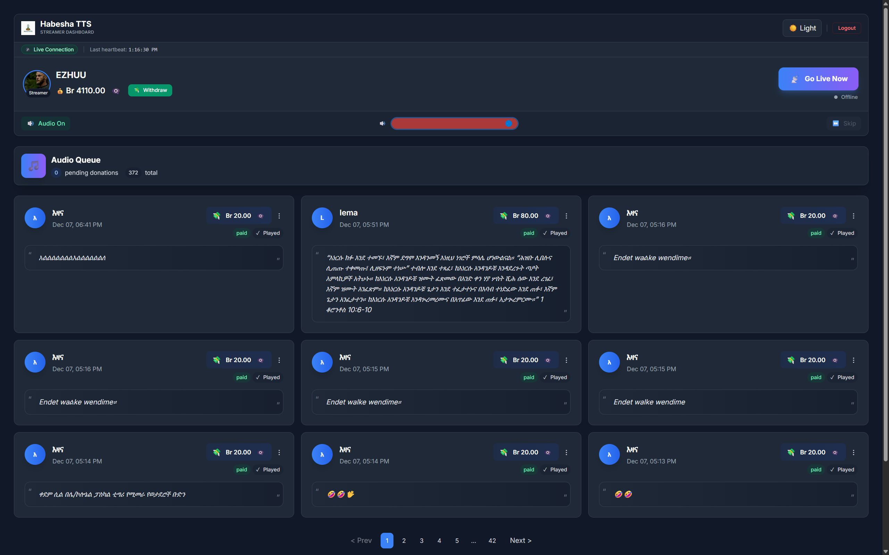
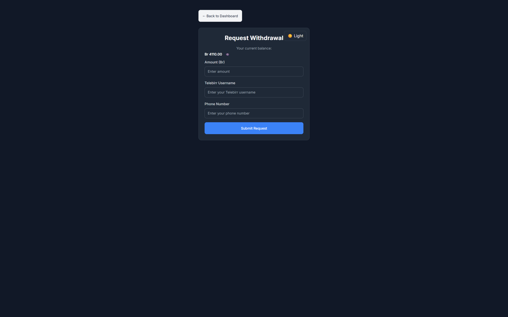
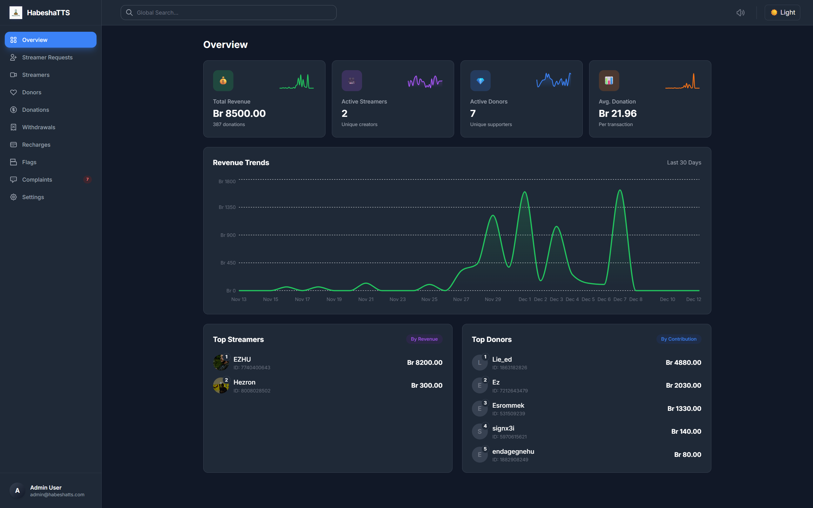
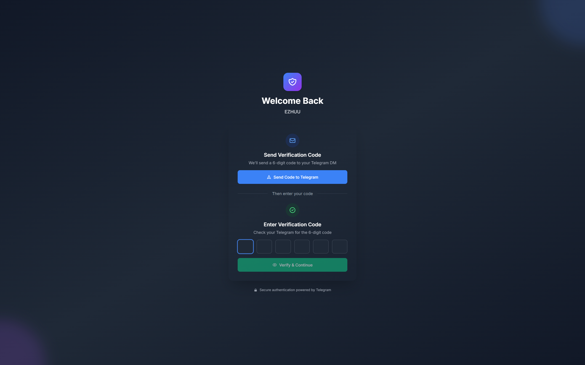

# CONCEPT PAPER

---

<div align="center">

# 🇪🇹 HabeshaTTS

## **Real-Time AI-Powered Text-to-Speech Donation Platform**

### Concept Paper for Innovation Recognition & Licensing

---

**Submitted to:**  
**Ministry of Innovation and Technology**  
**Federal Democratic Republic of Ethiopia**

---

**Submitted by:**  
**HabeshaTTS Team**  
www.habeshatts.com

---

**Date:** December 2025

</div>

---

## Table of Contents

1. [Executive Summary](#1-executive-summary)
2. [Problem Statement](#2-problem-statement)
3. [Our Solution](#3-our-solution)
4. [Innovation & Technology](#4-innovation--technology)
5. [Market Opportunity](#5-market-opportunity)
6. [Social & Economic Impact](#6-social--economic-impact)
7. [Business Model](#7-business-model)
8. [Implementation Status](#8-implementation-status)
9. [Future Vision](#9-future-vision)
10. [Team Profile](#10-team-profile)
11. [Support Requested](#11-support-requested)
12. [Conclusion](#12-conclusion)

---

## 1. Executive Summary

**HabeshaTTS** is Ethiopia's first AI-powered real-time Text-to-Speech donation platform, designed specifically for Ethiopian content creators and streamers. Our platform bridges the gap between local content creators and their audiences by enabling fans to send spoken Amharic messages during live streams—creating an interactive, engaging, and monetizable experience.

### Key Highlights

| Metric | Value |
|--------|-------|
| **Platform Status** | ✅ Fully Operational |
| **Technology** | AI-Powered Amharic TTS |
| **Target Users** | Ethiopian Streamers & Content Creators |
| **Primary Language** | Amharic (አማርኛ) |
| **Innovation Category** | Digital Economy / Creative Tech |

### What Makes Us Unique

- **First-of-its-kind** in Ethiopia: No existing platform offers real-time Amharic TTS for streamers
- **Localized AI**: Built specifically for Ethiopian languages and cultural context
- **Creator Economy Enabler**: Empowering young Ethiopians to monetize their content
- **Telegram Integration**: Leveraging Ethiopia's most popular messaging platform

---

## 2. Problem Statement

### The Challenge

Ethiopia has a rapidly growing community of content creators, streamers, and digital entertainers. However, they face critical challenges:

```
┌─────────────────────────────────────────────────────────────────┐
│                    PROBLEMS FACED BY CREATORS                    │
├─────────────────────────────────────────────────────────────────┤
│                                                                  │
│  ❌ No localized monetization tools                             │
│     → Global platforms (Twitch, YouTube) don't support          │
│       Ethiopian payment methods or Amharic TTS                  │
│                                                                  │
│  ❌ Limited audience engagement options                          │
│     → Text chat is impersonal and easily missed during          │
│       live streams                                               │
│                                                                  │
│  ❌ Payment friction                                             │
│     → International platforms require credit cards,             │
│       which most Ethiopian fans don't have                      │
│                                                                  │
│  ❌ Language barriers                                            │
│     → Existing TTS services don't support Amharic               │
│       or sound robotic/unnatural                                │
│                                                                  │
└─────────────────────────────────────────────────────────────────┘
```

### The Gap

While platforms like Streamlabs and StreamElements serve Western creators, **no equivalent exists for Ethiopian creators**. This leaves a significant portion of Ethiopia's youth—who are increasingly turning to content creation—without proper tools to build sustainable digital careers.

---

## 3. Our Solution

### HabeshaTTS Platform

We built a complete ecosystem that connects donors, streamers, and administrators through an intelligent, real-time system.

```
╔══════════════════════════════════════════════════════════════════╗
║                     HABESHATTS ECOSYSTEM                          ║
╠══════════════════════════════════════════════════════════════════╣
║                                                                   ║
║    👤 DONOR                    🎙️ STREAMER                        ║
║    ┌─────────┐                ┌─────────────┐                    ║
║    │Telegram │───Message+$───▶│  Dashboard  │                    ║
║    │   Bot   │                │  (Real-time)│                    ║
║    └─────────┘                └──────┬──────┘                    ║
║         │                            │                           ║
║         ▼                            ▼                           ║
║    ┌─────────┐                ┌─────────────┐                    ║
║    │ Payment │                │ 🔊 AI TTS   │                    ║
║    │ System  │                │   Playback  │                    ║
║    └─────────┘                └─────────────┘                    ║
║                                                                   ║
║                    🛡️ ADMIN DASHBOARD                             ║
║              ┌─────────────────────────────┐                     ║
║              │ • Streamer Management       │                     ║
║              │ • Fraud Detection           │                     ║
║              │ • Payment Oversight         │                     ║
║              │ • Analytics & Reports       │                     ║
║              └─────────────────────────────┘                     ║
║                                                                   ║
╚══════════════════════════════════════════════════════════════════╝
```

### Key Features

#### For Donors (Fans)
- 💬 Send Amharic text messages via Telegram
- 🔊 Messages converted to natural-sounding speech
- 💰 Easy payment through local methods
- 🎯 Direct interaction with favorite streamers

#### For Streamers (Content Creators)
- 📺 Real-time dashboard with donation queue
- 🎵 Automatic TTS audio playback during streams
- 💵 Instant balance tracking and withdrawals
- 📊 Analytics and donation history
- 🚦 "Go Live" status broadcasting to fans

#### For Platform (Administration)
- 👥 Streamer onboarding and verification
- 🛡️ Fraud prevention and donor moderation
- 💳 Recharge and withdrawal management
- 📈 Platform-wide analytics

---

## 4. Innovation & Technology

### Technical Architecture

```
┌────────────────────────────────────────────────────────────────────┐
│                    HABESHATTS ARCHITECTURE                          │
├────────────────────────────────────────────────────────────────────┤
│                                                                     │
│  ┌─────────────┐    ┌─────────────┐    ┌─────────────────────────┐ │
│  │   FRONTEND  │    │   BACKEND   │    │     AI/ML SERVICES      │ │
│  │             │    │             │    │                         │ │
│  │ • React.js  │◄──▶│ • Node.js   │◄──▶│ • Google Cloud TTS      │ │
│  │ • Vite      │    │ • Express   │    │ • Amharic Voice Models  │ │
│  │ • Tailwind  │    │ • Socket.IO │    │ • Text Sanitization     │ │
│  │             │    │ • BullMQ    │    │                         │ │
│  └─────────────┘    └──────┬──────┘    └─────────────────────────┘ │
│                            │                                        │
│  ┌─────────────┐    ┌──────▼──────┐    ┌─────────────────────────┐ │
│  │  TELEGRAM   │    │  DATABASE   │    │      QUEUE SYSTEM       │ │
│  │     BOT     │    │             │    │                         │ │
│  │             │◄──▶│ • PostgreSQL│◄──▶│ • Redis                 │ │
│  │ • Commands  │    │ • Ledgers   │    │ • BullMQ Workers        │ │
│  │ • Payments  │    │ • Users     │    │ • Real-time Processing  │ │
│  │ • Flows     │    │ • Donations │    │                         │ │
│  └─────────────┘    └─────────────┘    └─────────────────────────┘ │
│                                                                     │
└────────────────────────────────────────────────────────────────────┘
```

### Innovation Highlights

**Our Approach:** We leverage existing world-class AI services (Google Cloud TTS, Gemini) 
and combine them innovatively to solve uniquely Ethiopian problems. We don't reinvent 
the wheel—we build smart solutions on top of proven technology.

| Innovation Area | Description |
|-----------------|-------------|
| **Amharic AI Voice** | Using Google Cloud's Amharic TTS to enable native language support for streamers |
| **Real-time Processing** | Sub-second message-to-speech conversion using queue-based architecture |
| **Telegram Integration** | First Ethiopian platform to use Telegram as a donation gateway |
| **Dual-Write Ledger** | Financial-grade transaction logging for trust and transparency |
| **State Machine Bot** | Intelligent conversational flows with Redis-backed persistence |
| **Local Problem Solving** | Combining global AI with local payment methods and cultural context |

### Technology Stack

```
┌──────────────────────────────────────────────────────────────┐
│                     TECHNOLOGY STACK                          │
├──────────────────────────────────────────────────────────────┤
│                                                               │
│  FRONTEND          BACKEND           INFRASTRUCTURE          │
│  ─────────         ───────           ──────────────          │
│  • React 18        • Node.js 18+     • PostgreSQL            │
│  • Vite            • Express.js      • Redis                 │
│  • Tailwind CSS    • Socket.IO       • Docker                │
│  • Recharts        • BullMQ          • Cloud Deployment      │
│                                                               │
│  AI/ML             INTEGRATIONS      SECURITY                │
│  ─────             ────────────      ────────                │
│  • Google TTS      • Telegram API    • JWT Auth              │
│  • am-ET Voices    • Payment APIs    • Rate Limiting         │
│  • Text Sanitize   • WebSockets      • Admin Tokens          │
│                                                               │
└──────────────────────────────────────────────────────────────┘
```

---

## 5. Market Opportunity

### Ethiopian Digital Landscape

```
┌─────────────────────────────────────────────────────────────────┐
│                 ETHIOPIA'S DIGITAL GROWTH                        │
├─────────────────────────────────────────────────────────────────┤
│                                                                  │
│  📱 Mobile Users:        70+ Million                            │
│  🌐 Internet Users:      30+ Million (growing 20%+ annually)    │
│  💬 Telegram Users:      25+ Million active users               │
│  🎮 Gaming/Streaming:    Fastest growing entertainment segment  │
│  👥 Youth Population:    70% under age 30                       │
│                                                                  │
└─────────────────────────────────────────────────────────────────┘
```

### Target Market Segments

| Segment | Size Estimate | Opportunity |
|---------|---------------|-------------|
| **Content Creators** | 10,000+ active streamers | Platform adoption |
| **Gaming Community** | 500,000+ gamers | TTS donations during streams |
| **Music/Entertainment** | 50,000+ artists | Fan engagement tool |
| **Donors/Fans** | 5+ million potential | Micro-transaction economy |

### Competitive Advantage

```
                    HABESHATTS vs GLOBAL PLATFORMS
                    
Feature              HabeshaTTS    Streamlabs    YouTube Super Chat
─────────────────────────────────────────────────────────────────────
Amharic TTS            ✅             ❌              ❌
Local Payments         ✅             ❌              ❌
Telegram Integration   ✅             ❌              ❌
Ethiopian Support      ✅             ❌              ❌
Creator Share          60%           70%             70%
No Credit Card Needed  ✅             ❌              ❌
Telebirr Support       ✅             ❌              ❌
```

---

## 6. Social & Economic Impact

### Direct Impact

```
┌─────────────────────────────────────────────────────────────────┐
│                    IMPACT AREAS                                  │
├─────────────────────────────────────────────────────────────────┤
│                                                                  │
│  💼 JOB CREATION                                                │
│  ├── Enables full-time content creation careers                 │
│  ├── Reduces youth unemployment through digital economy         │
│  └── Creates ecosystem jobs (moderators, managers, editors)     │
│                                                                  │
│  💰 ECONOMIC EMPOWERMENT                                        │
│  ├── Direct income for creators (no middlemen)                  │
│  ├── Keeps money within Ethiopian economy                       │
│  └── Enables micro-entrepreneurship                             │
│                                                                  │
│  🎓 SKILL DEVELOPMENT                                           │
│  ├── Content creation skills                                    │
│  ├── Digital literacy                                           │
│  └── Entrepreneurship mindset                                   │
│                                                                  │
│  🌍 CULTURAL PRESERVATION                                       │
│  ├── Promotes Amharic language in digital spaces               │
│  ├── Showcases Ethiopian culture to global audience            │
│  └── Creates Ethiopian-owned digital infrastructure            │
│                                                                  │
└─────────────────────────────────────────────────────────────────┘
```

### Impact Metrics (Projected - Year 1-3)

| Metric | Year 1 | Year 2 | Year 3 |
|--------|--------|--------|--------|
| Active Streamers | 20 | 100 | 500 |
| Active Donors | 500 | 3,000 | 15,000 |
| Monthly Transactions | 2,000 | 15,000 | 75,000 |
| Creator Income Generated | 500K ETB | 3M ETB | 15M ETB |
| Direct Jobs Created | 3 | 10 | 30 |

### Alignment with National Goals

✅ **Digital Ethiopia 2025** - Contributing to digital economy growth  
✅ **Youth Employment** - Creating opportunities for young Ethiopians  
✅ **Innovation Ecosystem** - Building local technology capacity  
✅ **Foreign Exchange** - Reducing dependency on foreign platforms  

---

## 7. Business Model

### Revenue Streams

```
┌─────────────────────────────────────────────────────────────────┐
│                    REVENUE MODEL                                 │
├─────────────────────────────────────────────────────────────────┤
│                                                                  │
│  ┌─────────────────────────────────────────────────────────┐   │
│  │  PRIMARY: Revenue Share (60/40 Split)                   │   │
│  │  ════════════════════════════════════════════════════   │   │
│  │  • Donor pays 100 ETB                                   │   │
│  │  • Streamer receives: 60 ETB (60%)                     │   │
│  │  • Platform receives: 40 ETB (40%)                     │   │
│  │                                                         │   │
│  │  This covers:                                           │   │
│  │  • AI TTS processing costs                              │   │
│  │  • Cloud infrastructure                                 │   │
│  │  • Platform development & maintenance                   │   │
│  │  • Customer support                                     │   │
│  └─────────────────────────────────────────────────────────┘   │
│                                                                  │
│  ┌─────────────────────────────────────────────────────────┐   │
│  │  FUTURE: Premium Features                               │   │
│  │  ════════════════════════════════════════════════════   │   │
│  │  • Custom TTS voices for streamers                      │   │
│  │  • Priority queue for donors                            │   │
│  │  • Advanced analytics dashboard                         │   │
│  │  • Event/concert TTS solutions                          │   │
│  └─────────────────────────────────────────────────────────┘   │
│                                                                  │
└─────────────────────────────────────────────────────────────────┘
```

### Our Innovation Approach

We don't build AI from scratch—we **innovatively combine existing AI services** 
(Google Cloud TTS, Gemini) with local market needs to create unique solutions 
that weren't possible before. This is smart innovation: leveraging global 
technology to solve local problems.

### Unit Economics

```
Per 100 ETB Donation:
├── Streamer Revenue:     60 ETB (60%)
├── Platform Revenue:     40 ETB (40%)
│   ├── TTS Processing:   ~8 ETB
│   ├── Infrastructure:   ~7 ETB
│   ├── Operations:       ~10 ETB
│   └── Net Margin:       ~15 ETB
```

---

## 8. Implementation Status

### Current Status: ✅ LIVE & OPERATIONAL

```
┌─────────────────────────────────────────────────────────────────┐
│                 PLATFORM STATUS                                  │
├─────────────────────────────────────────────────────────────────┤
│                                                                  │
│  ✅ Platform:          Fully functional and deployed            │
│  ✅ Telegram Bot:      Live and operational                     │
│  ✅ Streamer Dashboard: Real-time donation queue working        │
│  ✅ Admin Panel:       Complete with analytics                  │
│  ✅ TTS Engine:        Amharic voice synthesis active           │
│  ✅ Payment Flow:      Recharge/Withdraw system ready           │
│                                                                  │
│  🧪 TESTING COMPLETED:                                          │
│  • End-to-end donation flow tested                              │
│  • Real-time audio playback verified                            │
│  • Multi-user concurrent access tested                          │
│  • Payment reconciliation validated                             │
│                                                                  │
│  🚀 READY FOR: Production launch with real users               │
│                                                                  │
└─────────────────────────────────────────────────────────────────┘
```

```
┌─────────────────────────────────────────────────────────────────┐
│                 DEVELOPMENT PROGRESS                             │
├─────────────────────────────────────────────────────────────────┤
│                                                                  │
│  COMPLETED ████████████████████████████████████████ 100%        │
│  ───────────────────────────────────────────────────────────    │
│  ✅ Core Platform Development                                   │
│  ✅ Telegram Bot Integration                                    │
│  ✅ Amharic TTS Implementation                                  │
│  ✅ Real-time Streamer Dashboard                                │
│  ✅ Admin Control Panel with Analytics                         │
│  ✅ Payment Flow (Recharge/Withdraw via Telebirr)              │
│  ✅ OTP-based Secure Authentication                            │
│  ✅ Streamer Onboarding System                                  │
│  ✅ Donor Management & Moderation                               │
│  ✅ Live Status Broadcasting                                    │
│  ✅ Revenue Analytics & Reporting                               │
│                                                                  │
│  IN PROGRESS ████████████░░░░░░░░░░░░░░░░░░░░░░░░░ 30%         │
│  ───────────────────────────────────────────────────────────    │
│  🔄 Mobile App Development                                      │
│  🔄 Direct Telebirr & Chapa API Integration                    │
│  🔄 Multi-language Support (Tigrinya, Oromiffa)                │
│                                                                  │
│  PLANNED ░░░░░░░░░░░░░░░░░░░░░░░░░░░░░░░░░░░░░░░░ 0%           │
│  ───────────────────────────────────────────────────────────    │
│  📋 Localized Streaming Platform (HabeshaStream)               │
│  📋 Creator Academy                                             │
│  📋 Advanced Analytics & Insights                               │
│                                                                  │
└─────────────────────────────────────────────────────────────────┘
```

### Platform Screenshots

The platform is fully functional and ready for production:

#### Streamer Dashboard
Real-time donation queue with Amharic message display, audio playback controls, and balance tracking.



#### Withdrawal System
Streamers can request withdrawals directly to their Telebirr accounts.



#### Admin Dashboard
Comprehensive admin panel with analytics, revenue trends, and user management.



#### Secure OTP Authentication
Streamers authenticate via Telegram OTP for secure dashboard access.



**Live Demo Available:** www.habeshatts.com

---

## 9. Future Vision

### Roadmap

```
┌─────────────────────────────────────────────────────────────────┐
│                      STRATEGIC ROADMAP                           │
├─────────────────────────────────────────────────────────────────┤
│                                                                  │
│  2025 Q4 ─────────────────────────────────────────              │
│  │ ✅ Platform Launch                                           │
│  │ ✅ Initial Streamer Onboarding                               │
│  │ ✅ Ministry Recognition Application                          │
│  │                                                               │
│  2026 Q1-Q2 ──────────────────────────────────────              │
│  │ 📱 Mobile App Launch (iOS & Android)                         │
│  │ 💳 Telebirr & CBE Integration                                │
│  │ 🌍 Support for Tigrinya & Oromiffa                          │
│  │                                                               │
│  2026 Q3-Q4 ──────────────────────────────────────              │
│  │ 🎬 HabeshaStream: Full Streaming Platform                    │
│  │ 🤖 AI-Powered Content Moderation                             │
│  │ 📊 Creator Analytics Suite                                   │
│  │                                                               │
│  2027+ ───────────────────────────────────────────              │
│  │ 🌐 Pan-African Expansion                                     │
│  │ 🎓 Creator Academy & Training                                │
│  │ 🏢 Enterprise Solutions                                      │
│                                                                  │
└─────────────────────────────────────────────────────────────────┘
```

### Long-term Vision: HabeshaStream

Our ultimate goal is to build **Ethiopia's first localized streaming platform**—a complete ecosystem where Ethiopian creators can:
- Stream content natively (not through YouTube/Twitch)
- Receive donations in local currency
- Access Amharic-first interface and tools
- Build sustainable careers in content creation

HabeshaTTS is the foundation for this larger vision.

---

## 10. Team Profile

### About HabeshaTTS

```
┌─────────────────────────────────────────────────────────────────┐
│                      TEAM HABESHATTS                             │
├─────────────────────────────────────────────────────────────────┤
│                                                                  │
│  🎓 WHO WE ARE                                                  │
│  ────────────────────────────────────────────────────────────   │
│  We are a team of young Ethiopian Computer Science graduates    │
│  passionate about using AI and technology to create positive    │
│  change in Ethiopia. We believe that Ethiopian problems need    │
│  Ethiopian solutions, built by Ethiopians who understand the    │
│  local context, culture, and needs.                             │
│                                                                  │
│  � TEAM MEMBERS                                                │
│  ────────────────────────────────────────────────────────────   │
│                                                                  │
│  👤 Edilu Densemo Tafesse - Founder & Team Lead                │
│     • Project Owner & Lead Developer                            │
│     • Full-stack development, AI integration                    │
│                                                                  │
│  👤 Esrom Mekbib - Co-Founder & Developer                      │
│     • Backend development, System architecture                  │
│                                                                  │
│  👤 Daniel H/Mariam - Co-Founder & Developer                   │
│     • Frontend development, UI/UX                               │
│                                                                  │
│  💡 OUR PHILOSOPHY                                              │
│  ────────────────────────────────────────────────────────────   │
│  • Build local solutions for local problems                     │
│  • Leverage cutting-edge AI for Ethiopian languages             │
│  • Empower youth through digital economy                        │
│  • Create sustainable, scalable technology businesses           │
│                                                                  │
│  🌐 WEBSITE: www.habeshatts.com                                 │
│  📧 EMAIL: ediludensemo1@gmail.com                              │
│                                                                  │
└─────────────────────────────────────────────────────────────────┘
```

### Core Competencies

| Area | Capability |
|------|------------|
| **Full-Stack Development** | React, Node.js, PostgreSQL, Redis |
| **AI/ML Integration** | Google Cloud AI, TTS, NLP |
| **Real-time Systems** | WebSockets, Queue Processing |
| **Bot Development** | Telegram API, State Machines |
| **Cloud Infrastructure** | Docker, Cloud Deployment, DevOps |

### Why Support Us?

1. **Proven Execution**: We have a working product, not just an idea
2. **Technical Excellence**: Built with modern, scalable architecture
3. **Local Understanding**: We know Ethiopian creators' real needs
4. **Vision & Ambition**: HabeshaTTS is step one of a larger mission
5. **Youth-Led Innovation**: Demonstrating Ethiopian youth capability

---

## 11. Support Requested

### The Licensing Challenge

```
┌─────────────────────────────────────────────────────────────────┐
│              ⚠️ CRITICAL CHALLENGE: LICENSING GAP               │
├─────────────────────────────────────────────────────────────────┤
│                                                                  │
│  HabeshaTTS operates in a NEW CATEGORY that doesn't exist       │
│  in Ethiopia's current business licensing framework:            │
│                                                                  │
│  ❌ We are NOT a traditional fintech (we don't hold funds)     │
│  ❌ We are NOT a payment processor (we use existing gateways)  │
│  ❌ We are NOT a media company (we enable creators)            │
│  ❌ We are NOT a telecom service (we use Telegram)             │
│                                                                  │
│  ✅ We ARE a CREATOR ECONOMY PLATFORM that:                    │
│     • Facilitates micropayments between fans and creators       │
│     • Uses AI technology for content generation (TTS)           │
│     • Enables digital entrepreneurship for Ethiopian youth      │
│                                                                  │
│  SIMILAR PLATFORMS GLOBALLY:                                    │
│  • Streamlabs (USA) - Donation platform for streamers           │
│  • Ko-fi (UK) - Creator support platform                        │
│  • Patreon (USA) - Creator monetization                         │
│                                                                  │
│  Ethiopia needs a licensing category for such platforms!        │
│                                                                  │
└─────────────────────────────────────────────────────────────────┘
```

### From the Ministry of Innovation and Technology

```
┌─────────────────────────────────────────────────────────────────┐
│                    SUPPORT REQUESTED                             │
├─────────────────────────────────────────────────────────────────┤
│                                                                  │
│  1️⃣  REGULATORY GUIDANCE (MOST CRITICAL)                        │
│  ─────────────────────────────────────────────────────────────  │
│  • Help define a licensing category for "Creator Economy        │
│    Platforms" or "Digital Content Monetization Services"        │
│  • Guidance on which existing license best fits our model       │
│  • Facilitation with relevant regulatory bodies:                │
│    - National Bank of Ethiopia (payment aspects)                │
│    - Ethiopian Communications Authority (if applicable)         │
│    - Ministry of Trade (business licensing)                     │
│  • Letter of support for operating while licensing is clarified │
│                                                                  │
│  2️⃣  OFFICIAL RECOGNITION                                       │
│  ─────────────────────────────────────────────────────────────  │
│  • Recognition as an innovative Ethiopian technology startup    │
│  • Endorsement for operating in the digital economy space       │
│  • Inclusion in ministry's innovation showcase                  │
│                                                                  │
│  3️⃣  PAYMENT INTEGRATION SUPPORT                                │
│  ─────────────────────────────────────────────────────────────  │
│  • Facilitation for official Telebirr API access               │
│  • Support for Chapa payment gateway integration               │
│  • Support for CBE Birr integration                            │
│  • Guidance on compliance requirements                          │
│                                                                  │
│  4️⃣  ECOSYSTEM ACCESS                                           │
│  ─────────────────────────────────────────────────────────────  │
│  • Connection to incubators and accelerators                    │
│  • Access to mentorship networks                                │
│  • Inclusion in government digitalization initiatives           │
│  • Platform for presenting at national tech events              │
│                                                                  │
└─────────────────────────────────────────────────────────────────┘
```

### What We Commit To

In return for ministry support, we commit to:

- ✅ Continued innovation in Ethiopian digital technology
- ✅ Job creation for Ethiopian youth
- ✅ Knowledge sharing with the local tech community
- ✅ Compliance with all regulatory requirements
- ✅ Transparent operations and reporting
- ✅ Collaboration with government digital initiatives

---

## 12. Conclusion

HabeshaTTS represents a new generation of Ethiopian innovation—built by young Ethiopians, for Ethiopians, using world-class technology. We have moved beyond the idea stage to deliver a fully functional platform that is already enabling content creators to monetize their work.

### Our Ask

We respectfully request the Ministry of Innovation and Technology to:

1. **Recognize** HabeshaTTS as an innovative Ethiopian technology solution
2. **Support** our licensing and regulatory compliance journey
3. **Connect** us with the broader innovation ecosystem

### Our Promise

With your support, we will:

- Create jobs for Ethiopian youth
- Build Ethiopian-owned digital infrastructure
- Showcase Ethiopian innovation to the world
- Contribute to Digital Ethiopia 2025 goals

---

<div align="center">

### 🇪🇹 Building Ethiopia's Digital Future, One Innovation at a Time 🇪🇹

---

**Contact Information**

**Founder:** Edilu Densemo Tafesse  
**Website:** www.habeshatts.com  
**Email:** ediludensemo1@gmail.com  
**Telegram:** [@HabeshaTTSBot]

---

*"The best time to build Ethiopian technology was 10 years ago. The second best time is now."*

---

**© 2025 HabeshaTTS. All Rights Reserved.**

</div>
